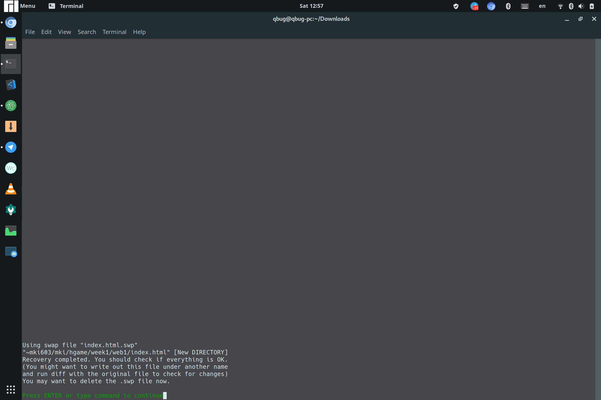
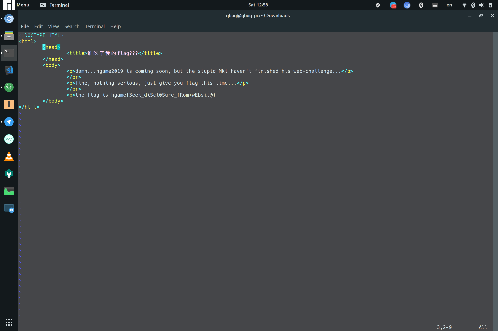

# 量子Bug 的 week 1 writeup

第一次参赛，第一次要写 writeup ，结果就搞错时间了😭😭😭误把 writeup ddl 当成计分 ddl ，结果就去浪了一天（由于体重原因被家人朋友强行拉去健身房）回来一看，把做了一半的题做完怎么不计分了。。。

## web

###　谁吃了我的flag [已完成]

进网页一看，这个 flag 是不是缺了点什么？哦 vim没保存？难道是文件结尾会留下什么痕迹？

查了一下， vim 没保存是会有从临时文件恢复恢复的方法。可是我上哪找临时文件去呀？

翻 QQ 比赛公告时，突然看到学长的提示：搜索 CTF Web 泄露。于是真相大白，原来是利用 Web 管理员不小心把临时文件也上传的不当操作来获取代码。

访问 http://118.25.111.31:10086/.index.html.swp 即可获取临时文件，然后输入 `vim -r index.html.swp`

