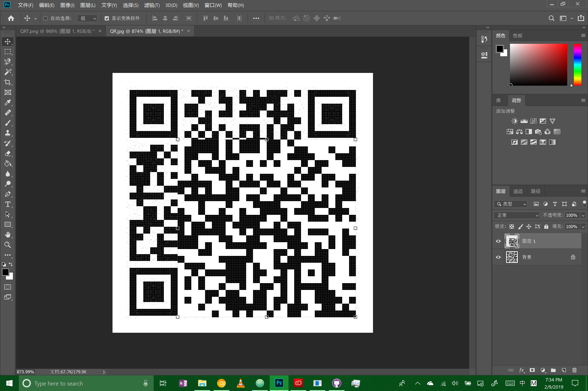
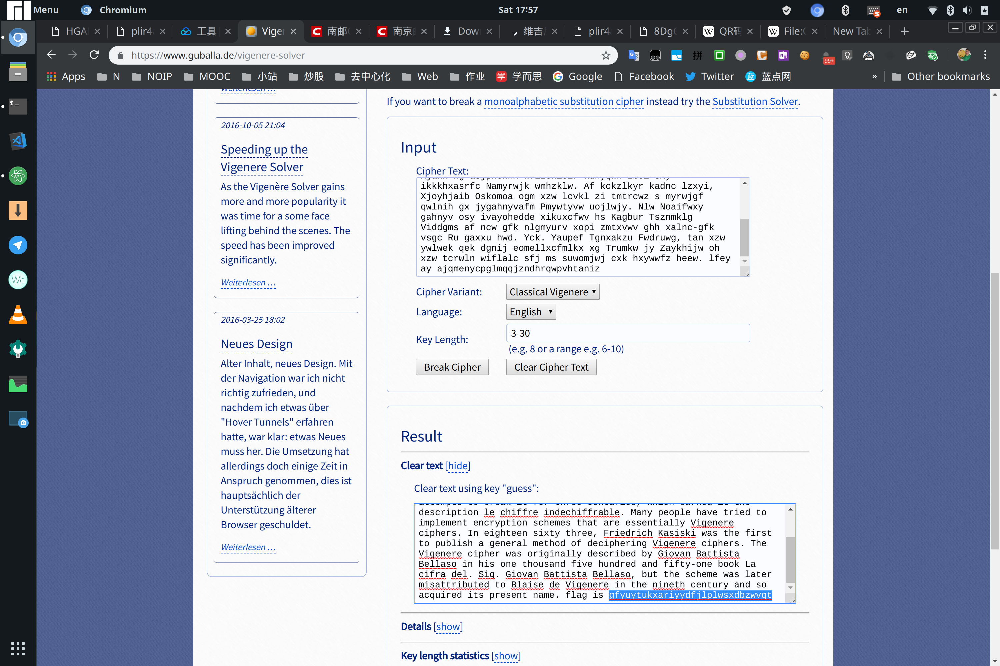

# 量子Bug 的 week 2 writeup

完蛋，本来觉得这个星期应该能好好完成了，结果被拉去翻山越岭，又差点咕咕咕。。。

## MISC

### Are You Familiar with DNS Records?[已完成]

相当简单的一道题，使用 `drill project-a11.club`相关命令即可。然并卵的 hint 确实没什么用。。。邮箱相关的记录类型有很多，都看看就找到了。而且这种文本信息不都是放在 TXT 类型记录里的嘛！

### 初识二维码[已完成]

下载，解压，得到 DataURI ，复制到 chrome 地址栏，得到缺少定位标志的 QR code图片。数出来这个包含矫正标志和数据区的部分是 26 * 26 的，在线生成一个去除定位标志后剩余 26 * 26 大小的 QR code ，进入 PS 进行拼接，手机扫一扫得到 flag 。

## CRYPTO

### Vigener~[已完成]

嘿嘿嘿~直到我找到了这个网站 [https://www.guballa.de/vigenere-solver](https://www.guballa.de/vigenere-solver)

