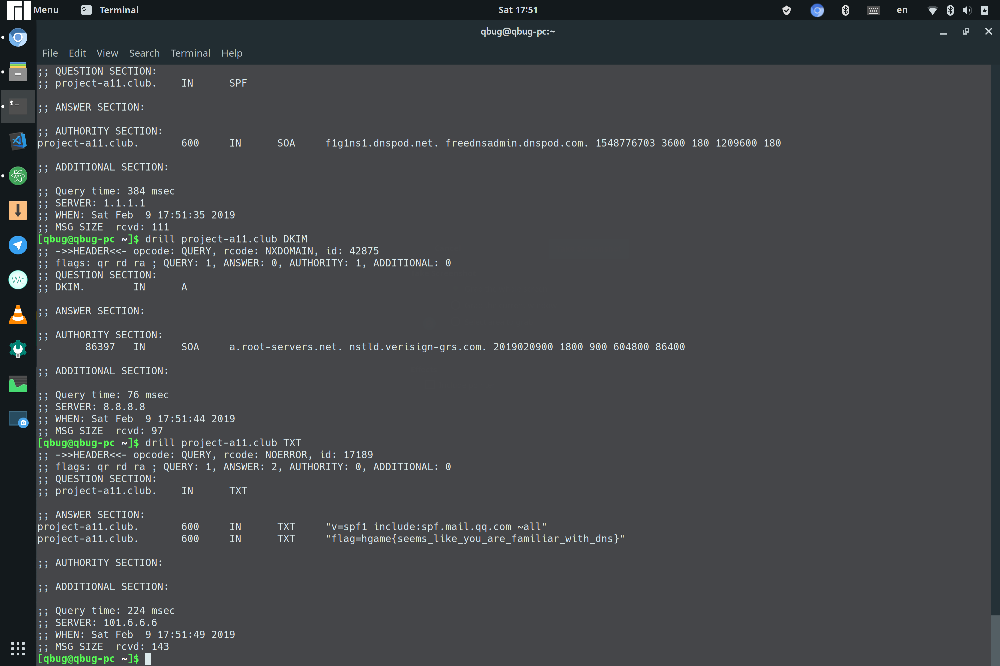

# 量子Bug 的 week 2 writeup

完蛋，本来觉得这个星期应该能好好完成了，结果被拉去翻山越岭，又差点咕咕咕。。。

## MISC

### Are You Familiar with DNS Records?[已完成]

相当简单的一道题，使用 `drill project-a11.club`相关命令即可。然并卵的 hint 确实没什么用。。。邮箱相关的记录类型有很多，都看看就找到了。而且这种文本信息不都是放在 TXT 类型记录里的嘛！

## CRYPTO

### Vigener~[已完成]

嘿嘿嘿~直到我找到了这个网站 [https://www.guballa.de/vigenere-solver](https://www.guballa.de/vigenere-solver)

